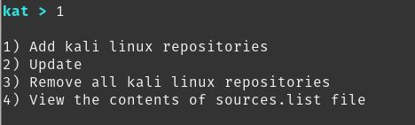

# Install via katoolin in ubuntu (TODO)

# Step 1 : Preapere Ubuntu for installation

    sudo apt-get update && sudo apt-get install -y software-properties-common python git
    sudo add-apt-repository universe

# Step 2 : Get katoolin installer from Github

    git clone https://github.com/LionSec/katoolin.git
    sudo cp katoolin/katoolin.py /usr/bin/katoolin.py
    suco chmod +x /usr/bin/katoolin.py
# Step 3 : Install 
- Run Katoolin installer 

    sudo katoolin

- From first menu, choose 1 => Add kali repositories & update , you should see this 

- Select 1 (add repositories)
- After adding , you will back to selection menu, choose 2 (update)
- After update complete type back. 

# Step 4 : Select tools to install 
- From home page, select 2 (View Categories). you should see this selection page. 

(todo, I will add screenshots)

# Step 5 : Install menu & indicator (optional for some ubuntu distributions) 
- From home page, select 3(install classicmenu indicator)
- From home page, select 4(install kali menu)

# Notes : 
1. type "back" to get to previous menu
2. type "gohome" to get back to first selection page (home)
3. Almost no time, under any catagory, select "0" works for installing all tools togather. 
