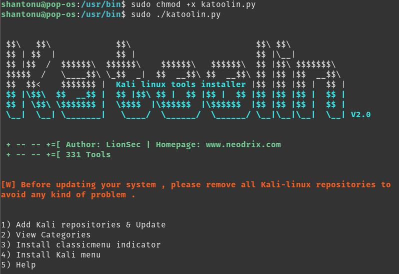

# Install via katoolin in ubuntu

# Step 1 : Preapere Ubuntu for installation

    sudo apt-get update && sudo apt-get install -y software-properties-common python git
    sudo add-apt-repository universe

# Step 2 : Get katoolin installer from Github

    git clone https://github.com/LionSec/katoolin.git
    sudo cp katoolin/katoolin.py /usr/bin/katoolin.py
    suco chmod +x /usr/bin/katoolin.py
# Step 3 : Install 

    sudo katoolin

