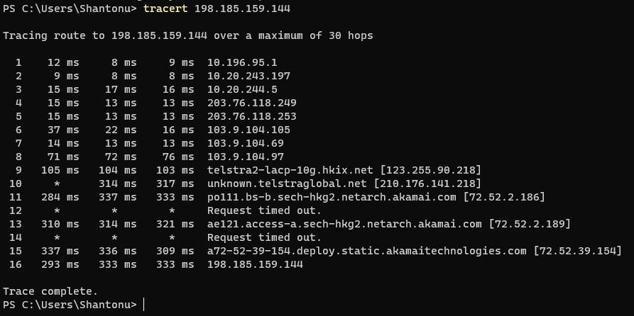

# tracert 
Tracert is an windows network diagnosis tool.

The TRACERT diagnostic utility determines the route to a destination by sending Internet Control Message Protocol (ICMP) echo packets to the destination. In these packets, TRACERT uses varying IP Time-To-Live (TTL) values. Because each router along the path is required to decrement the packet's TTL by at least 1 before forwarding the packet, the TTL is effectively a hop counter. When the TTL on a packet reaches zero (0), the router sends an ICMP "Time Exceeded" message back to the source computer.

TRACERT sends the first echo packet with a TTL of 1 and increments the TTL by 1 on each subsequent transmission, until the destination responds or until the maximum TTL is reached. The ICMP "Time Exceeded" messages that intermediate routers send back show the route. Note however that some routers silently drop packets that have expired TTLs, and these packets are invisible to TRACERT.

TRACERT prints out an ordered list of the intermediate routers that return ICMP "Time Exceeded" messages. Using the -d option with the tracert command instructs TRACERT not to perform a DNS lookup on each IP address, so that TRACERT reports the IP address of the near-side interface of the routers.

[source](https://support.microsoft.com/en-us/help/314868/how-to-use-tracert-to-troubleshoot-tcp-ip-problems-in-windows)

# Why tracert?
- Trace your client request path to destination server. 
- Knowing your IP routs
- diagnosis low latency/connectivity issues 

# Syntax

- simple : tracert _ip_
- with all options : tracert -d -h maximum_hops -j host-list -w timeout target_host

# Options
- -d : Specifies to not resolve addresses to host names
- -h maximum_hops : Specifies the maximum number of hops to search for the target
- -j host-list :  Specifies loose source route along the host-list
- -w timeout : Waits the number of milliseconds specified by timeout for eachreply
- target_host:  Specifies the name or IP address of the target host

# Example 

